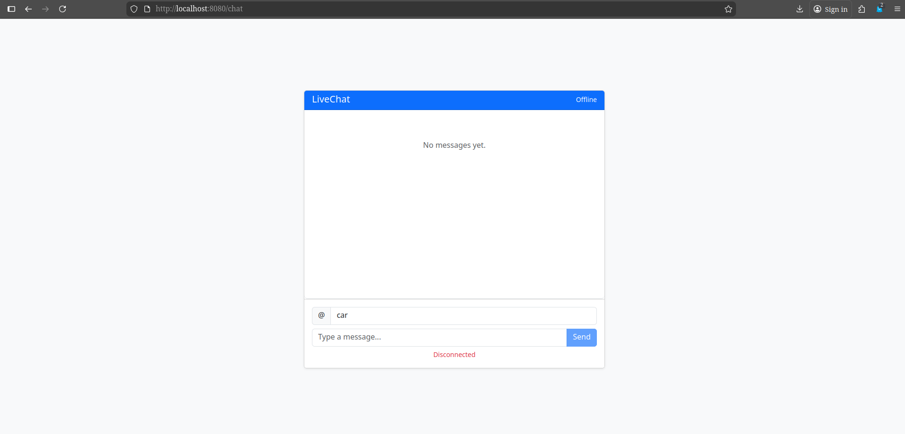
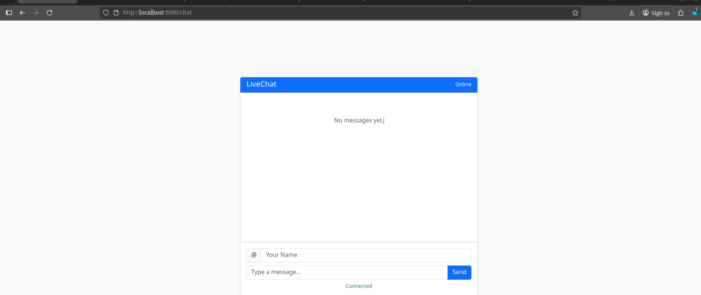
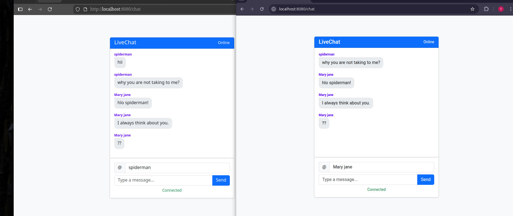

# 💬 Live Chat Application

A real-time chat application built using **Spring Boot, WebSocket, STOMP, and SockJS**.
This project demonstrates how to implement bi-directional communication between client and server.

---

## 🚀 Features

* 🔹 Real-time messaging using WebSockets
* 🔹 STOMP protocol for message handling
* 🔹 Simple and clean UI using Bootstrap
* 🔹 Auto-scroll chat window
* 🔹 Connection status indicator (Online/Offline)

---

## 🛠️ Tech Stack

* **Backend:** Spring Boot, WebSocket, STOMP
* **Frontend:** HTML, CSS, JavaScript, Bootstrap
* **Protocol:** SockJS + STOMP

---

## 📂 Project Structure

```
src/
 ├── config/        # WebSocket configuration
 ├── controller/    # Message handling controller
 ├── model/         # Chat message model
 └── resources/
```

---

## ⚙️ How It Works

1. Client connects to WebSocket endpoint `/chat`
2. Messages are sent to `/app/sendMessage`
3. Server broadcasts messages to `/topic/messages`
4. All subscribed clients receive messages instantly

---

## ▶️ Run the Project

### 1. Clone the repository

```
git clone https://github.com/your-username/live-chat-app.git
cd live-chat-app
```

### 2. Run Spring Boot application

```
mvn spring-boot:run
```

### 3. Open in browser

```
http://localhost:8080/chat
```

---

## 📸 Screenshots

### Chat offline Interface



### Connected State



### Messaging Demo



---

## ⚠️ Limitations

* No database (messages are not stored)
* No authentication system
* Single-room chat only

---

## 🔮 Future Improvements

* Add user authentication (JWT / Login system)
* Store messages using database (MySQL / MongoDB)
* Private chat rooms
* Typing indicator feature

---

## 👨‍💻 Author

Anuj kumar

---
